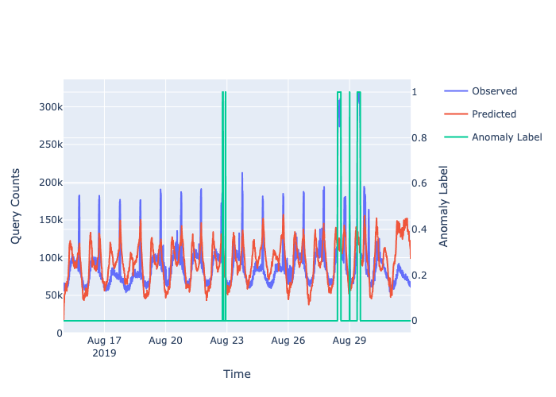

******
Manual
******
``dnspredict`` is a Python implementation of a *Long Short-Term Memory* (LSTM) network for the predictive modeling of the Domain Name Server (DNS) system. The model is trained to predict the volume of DNS queries that the system will encounter in the next time-interval for a given domain. A statistical anomaly detection module monitors the difference between the predicted and observed volumes to identify system-wide anomalies in the query counts. The following figure shows the overview of the predictive model, coupled with the anomaly detection module.

The input to the model is a time-series of vector of location-wise counts for a given domain. Optionally, ``nxdomain`` query counts can also be included in the input vector. The neural network consists of one or more layers of LSTM nodes, that combine the inputs in a non-linear fashion, along with the historical signal (or *memory*). The number of LSTM nodes in a layer correspond to the short-term memory used by the layer. 

An optional **attention** layer can be included after the first LSTM layer. This layer allows the model to pay selective attention (or focus) to a few inputs, and can improve the performance. Additionally, the output of the attention layer can also allow us to explain the model outputs, in terms of the inputs. This will be illustrated in the experimental results.

Requirements
############
The implementation has been tested on ``python 3.7.3`` and requires following packages: 

+---------------------+------------+
| Package             | Version    |
+=====================+============+
| ``scikit-learn``    |    0.21.2  |
+---------------------+------------+
| ``numpy``           |    1.16.4  |
+---------------------+------------+
| ``pandas``          |    0.24.2  |
+---------------------+------------+
| ``tensorflow``      |    1.13.1  |
+---------------------+------------+
| ``keras``           |    2.3.1   |
+---------------------+------------+
| ``plotly``          |    4.14.1  |
+---------------------+------------+

.. note:: The ``plotly`` library is only for plotting. While ``keras`` was built using the ``tensorflow`` backend, other backends could work as well.

Usage
#####
All functions are implemented in the ``dnspredict`` module. Refer to the ``DriverNotebook.ipynb`` notebook for examples.  

Preparing data
**************
We can either start with the `response.json` file or the `.dat` file and convert it into a format that can be used in the pipeline. The desired `Pandas DataFrame` has the following format:

+-------------+------------+------------+------------+------------+
| Index       | Location 1 | Location 2 |   ...      | Location n |
+=============+============+============+============+============+
| Time stamp 1| count 1    | count 2    | ...        | count n    |
+-------------+------------+------------+------------+------------+

Two loading functions are provided that can load data from a ``json`` or a ``csv`` file into the above format.

.. currentmodule:: dnspredict 
.. autofunction:: prepData

.. currentmodule:: dnspredict 
.. autofunction:: prepDataJSON

The ``filter`` parameter can be used to create desired subsets for analysis. For instance, if one is interested in analyzing data for a single location (e.g., `1`), for only `udp` and `tcp` protocols and for a single domain (e.g., `dnsmadeeasy.com`), one can prepare data as follows::

        from dnspredict import *

        filters = {'protocol':['udp','tcp'],'domain':['dnsmadeeasy.com']}
        data = prepData(filename,locs=['1'],filters=filters)

Similarly, one can pick out the ``nxdomain`` counts using the same function, but with an additional condition in the filter::
        
        filters_nx= {'protocol':['udp','tcp'],'record_name':['nxdomain'],'domain':['dnsmadeeasy.com']}
        data_nx = prepData(filename,locs=['1'],filters=filters,index=data.index)

Note that you can pass an explicit `index` so that the index of the returned data set matches the index from the previous data set. 

The data can be visualized using the ``plotly`` library::

        px.line(data,x=data.index,y=data.columns,title='dnsmadeeasy.com')

.. image:: sampledata.png
    :width: 600px
    :align: center

Preparing training data
***********************
To train the model, use the following function to prepare the training and test data sets.

.. currentmodule:: dnspredict 
.. autofunction:: prepTFData

The `prepTFData` function can be used to create the training and test data sets for analysis. For example::
        
        target_locs = list(data.columns)
        include_nx = False

        train_start = pd.to_datetime('2019-07-24 00:00:00')
        train_end = pd.to_datetime('2019-08-21 23:59:59')
        history = 1 # number of consecutive observations to concatenate as a "single observation"
        num_timepoints = 144

        df_train = data[train_start:train_end]
        df_train_nx = data_nx[train_start:train_end]
        trainX_arr,trainY_arr,scaler = prepTFData(df_train,
                                          target_locs,history=history,
                                          num_timepoints=num_timepoints,include_nx = include_nx,
                                          data_nx=df_train_nx)

The above code will create the training data set and the scaler. 

The ``history`` and ``num_timepoints`` parameters have a similar impact on the resulting model. Both can be used to specify the size of the short term history in the model. While ``history`` concatenates several consecutive observations to create one input vector, and thus explicitly models the short-term dependencies, ``num_timepoints`` uses the original input vector, but ``num_timepoints`` observations are presented in a single batch and the model maintains the history over ``num_timepoints`` consecutive LSTM units. The number of parameters to be trained are fewer in the latter case.

Building the model
******************
The LSTM model is created using the following function.

.. currentmodule:: dnspredict 
.. autofunction:: buildLSTMModel

The ``buildLSTMModel`` permits increasing the complexity of the model (for modeling complex relationship between the input and output) by adding more LSTM layers (`n_layers`) and increasing the size of the output of each LSTM layer (`n_units`). The overfitting can be controlled by increasing the ``l1`` and ``l2`` regularization parameters. Additionally, setting the ``attention`` flag to ``True`` adds an *attention* layer immediately after the first LSTM layer to focus the attention and allow for explainability. 

A model can be created as follows::

        attention = False
        n_layers = 2
        n_units = 8
        l1 = 0.01
        l2 = 0.01

        input_shape = (trainX_arr.shape[1], trainX_arr.shape[2])
        output_units = trainY_arr.shape[trainY_arr.ndim-1]
        model = buildLSTMModel(input_shape,output_units,n_units,n_layers,l1,l2,attention=attention)        

Training the model
******************
To train the model, execute the following::

        n_epochs = 50
        verbose = 1 #this controls the level of log messages during training
        model.fit(trainX_arr,trainY_arr,epochs=n_epochs,batch_size=1,verbose=verbose,shuffle=False)

The trained model can be saved to the disk and loaded back using the following two commands::

        model.save('/path/to/location')
        model = keras.models.load_model('path/to/location')

Using the model for predictions
*******************************
To prepare test data, pass the scalers from above to scale the test data appropriately::

        test_start = pd.to_datetime('2019-08-22 00:00:00')
        test_end = pd.to_datetime('2019-08-31 23:59:59')

        df_test = data[test_start:test_end]
        df_test_nx = data_nx[test_start:test_end]
        testX_arr,testY_arr = prepTFData(df_test,
                               target_locs,history=history,
                               num_timepoints=num_timepoints,
                               include_nx = include_nx,data_nx=df_test_nx,scaler=scaler)

.. warning:: Make sure that the test data is scaled in the same manner as the training data. 

To test the model on a new data set, the function ``modelPredict`` is used:
.. currentmodule:: dnspredict 
.. autofunction:: modelPredict 

To generate predictions, execute the following::

        df_preds = modelPredict(model,testX_arr,df_test.shape,df_test.columns,df_test.index,scaler[1])

To visually compare the observed and predicted counts for a given location::

        loc = 10
        df_loc_single = pd.concat([df_test[loc],df_preds[loc]],axis=1)
        df_loc_single.columns = ['Observed','Predicted']
        px.line(df_loc_single, x=df_loc_single.index, y=df_loc_single.columns,title='Domain {} Location {}'.format('dnsmadeeasy',loc))

Anomaly detection
*****************
For anomaly detection, first the parameters are estimated by obtaining predictions on the training data set using the trained model and the estimating mean and standard deviations for the residuals, using the ``estimateADParams`` function:

.. currentmodule:: dnspredict 
.. autofunction:: estimateADParams 

The parameters are estimated as follows::

        ad_params = estimateADParams(model,trainX_arr,trainY_arr,df_train.shape,scaler[1])

To generate anomaly labels for test data, use the ``detectAnomalies`` function:

.. currentmodule:: dnspredict
.. autofunction:: detectAnomalies

Using the model predictions obtained above, the anomaly scores can be obtained as::

        df_anomalies = detectAnomalies(df_test,df_preds,ad_params[1],thresh=3)

The following code can be used to plot the observed and predicted counts and the corresponding anomaly labels::

        from plotly.subplots import make_subplots
        loc = 3
        df_loc_single = pd.concat([df_test[loc],df_preds[loc],df_anomalies[loc]],axis=1)
        df_loc_single.columns = ['Observed','Predicted','Anomaly Label']

        subfig = make_subplots(specs=[[{"secondary_y": True}]])
        fig = px.line(df_loc_single, x=df_loc_single.index, y=['Observed','Predicted'],title='Domain {} Location {}'.format('dnsmadeeasy',loc))
        fig2 = px.line(df_loc_single, y=['Anomaly Label'], render_mode="webgl",)
        fig2.update_traces(yaxis="y2")
        subfig.add_traces(fig.data + fig2.data)
        subfig.layout.xaxis.title="Time"
        subfig.layout.yaxis.title="Query Counts"
        subfig.layout.yaxis2.title="Anomaly Label"
        subfig.for_each_trace(lambda t: t.update(line=dict(color=t.marker.color)))
        subfig.show()

